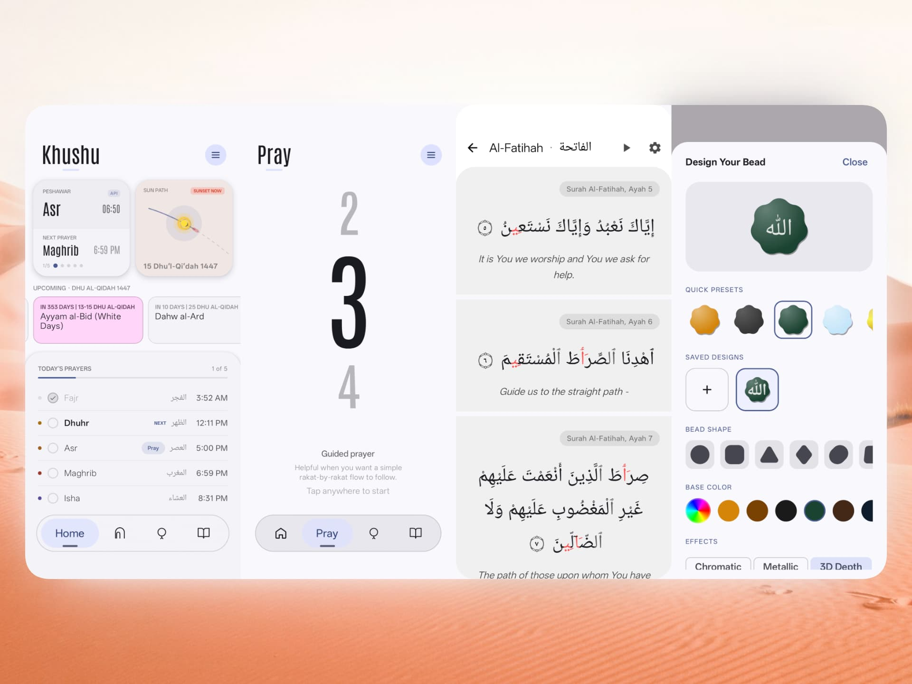

  

  
• Khushu •

  <strong>A calm space for your deen.</strong>

 

  
  
  
  
  <!--  -->

<i>Available on</i>

  &nbsp;&nbsp;
  &nbsp;&nbsp;
  &nbsp;&nbsp;
  

<i>Not on Play Store yet (empty pockets</i> 😁)

> [!NOTE]
> **Khushu is in Early Development.**
> We are currently in the Alpha stage of our journey. While we strive for a seamless experience, you may encounter occasional bugs. Your patience and feedback help us build a better sanctuary for the Ummah.

---

﷽

**Assalamu Alaikum wa Rahmatullahi wa Barakatuh,**

Welcome to **Khushu**.

In a world filled with digital noise, constant notifications, and endless scrolling, we built Khushu with a single intention (Niyyah): to give Muslims a beautiful, distraction-free space to connect with Allah (SWT).

**Our Promise to the Ummah:**
Khushu is and will always be **100% Free and Private**. 
There are no ads, no trackers, no subscriptions, and no selling of your data. Your worship is between you and your Creator. We simply want to provide the best tools to help you focus on what truly matters.

---

## ✨ Everything You Need. Nothing You Don't.

Khushu is packed with accurate prayer times, sunpath visuals, immersive Salah tracking, deeply customizable Tasbeeh collections, and a complete suite for reading and listening to the Quran, Tafsir, and Hadith—all wrapped in a deeply immersive aesthetic designed to help you attain *Khushu* (true focus and humility) in your worship.

  <kbd></kbd>

  <kbd></kbd>

---

## 💖 Support the Journey

While Khushu is completely free, developing, designing, and maintaining it takes hundreds of hours of love and effort. 

If you love the app and want to see it grow—if you want to help us reach more Muslims around the world and build even more amazing features—please consider supporting our development. Your donations go directly towards keeping this project alive, ad-free, and continuously improving.

**Support via Crypto:**

| Asset | Address |
| :--- | :--- |
|  | `bc1q04zs40e9cakxuu2lw3r04jc2vmmv084rvz5kx9` |
|  | `0x139aB14D67B1E0dAaEDe1CF5e3234B1Cc3644BE0` |
|  | `TDmZvrFGBKyP9opEL1FCzpvH9MXBmJ9r6q` |

---

## 🛠️ Roadmap

Khushu is growing fast. Here is what is coming next:

*   **🕌 Muslim Mosque Registry:** A clean, community-helpful way to discover and keep track of mosques timings in local areas.
*   **🧭 Qibla Direction:** A focused Qibla experience that feels calm and reliable instead of gimmicky.
*   **🏠 Homescreen Widget** Show your prayer progress and next prayer time on your homescreen.
*   **📖 Quran & Tafsir Polish:** Better Tafsir flow, richer reading ergonomics, and continued refinement in Quran study surfaces.
*   **✨ Ongoing Product Polish:** More consistency across settings, prayer flows, notifications, and small interaction details throughout the app.

---

## 🏗️ Technical Architecture & Setup

Khushu is built with a modern, high-performance tech stack designed for fluid animations and a premium feel.

*   **Language:** Kotlin 2.2.10
*   **UI Framework:** Jetpack Compose (Material 3)
*   **Architecture:** MVVM + Clean Architecture
*   **Database:** Room (for local storage and privacy)
*   **Animations:** Compose Graphics & Physics-based transitions

### Build Instructions
To build the project locally, you will need:
- **Android Studio Ladybug** (or newer)
- **JDK 17**
- **Android SDK 35** (Target)

1. Clone the repository: `git clone https://github.com/greykaizen/khushu.git`
2. Open the project in Android Studio.
3. Sync Gradle and run the `app` module on your device or emulator.

### Distribution Flavors

Khushu now has two build flavors:

- `full`: the regular app build used for GitHub releases and the normal distribution path
- `fdroid`: a compatibility flavor intended for F-Droid-style builds

Useful commands:

- Regular debug build: `./gradlew :app:assembleFullDebug`
- Regular release build: `./gradlew :app:assembleFullRelease`
- F-Droid debug build: `./gradlew :app:assembleFdroidDebug`
- F-Droid release build (single APK): `./gradlew :app:assembleFdroidRelease -Pkhushu.singleApk=true`

The `fdroid` flavor avoids Google Play Services location and uses bundled fonts instead of downloadable Google Fonts.

---

## 🤝 Contribution

This project is built by Muslims, for Muslims. We believe that coding, designing, and improving tools for the Ummah is a beautiful form of *Sadaqah Jariyah* (ongoing charity).

If you are a developer, designer, or translator, we would love your help! 
*   **Found a bug?** Open an issue to let us know.
*   **Have a feature idea?** Let's discuss it.
*   **Want to write code?** Check out our build instructions and open a Pull Request. 

Every line of code that helps a fellow Muslim remember Allah is a reward written for you, Insha'Allah.

---

## 📄 License & Brand Policy

**License:** This project is licensed under the **GNU General Public License v3.0 (GPLv3)**. See the [LICENSE](LICENSE) file for details.

**Trademark & Brand Policy:** While the source code is open, the brand identity is strictly protected. The name **'Khushu'**, the **Khushu logo**, and all related visual assets are strictly copyrighted with all rights reserved. If you choose to fork or distribute this codebase, you **must entirely rebrand** your fork by removing the Khushu name and all related branding assets. Distributing a modified version that retains the original branding constitutes trademark infringement.
